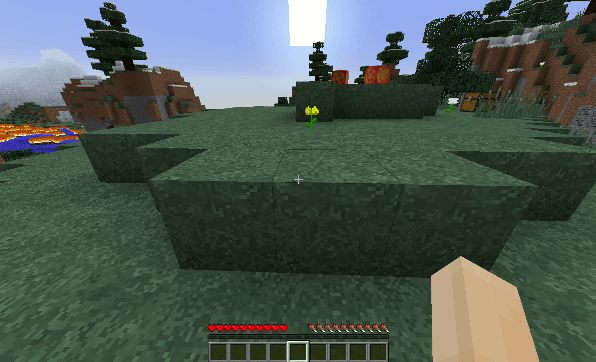

# ScoreboardMenu

> A unique Bukkit GUI library which allows you to use Scoreboards for option selection GUIs.



With **ScoreboardMenu** you can easily use Scoreboards as option selectors.

- Left Click to cycle forwards in a menu.
- Right Click to cycle backwards in a menu.
- Shift + Left Click to select a menu option.

## Usage

First, [install the plugin](#installation). Any plugin that uses this library will require the library itself to be installed.

Next, add the following to your Maven `pom.xml` file:

```xml
<!-- In your repositories section -->
<repository>
    <id>rayzr-repo</id>
    <url>https://cdn.rawgit.com/Rayzr522/maven-repo/master/</url>
</repository>

<!-- In your dependencies section -->
<dependency>
    <groupId>me.rayzr522</groupId>
    <artifactId>scoreboardmenu</artifactId>
    <version>1.0.0</version>
</dependency>
```

Then, in your `plugin.yml` file, add the following:

```yaml
depend: [ScoreboardMenu]
```

Now you can easily create a ScoreboardMenu using the simple builder-style API. Example:

```java
Player player; // Retrieve player from somewhere.

new ScoreboardMenu<Material>()
    .setTitle(ChatColor.BLUE + "Choose Type")
    .setSelectedPrefix(ChatColor.GREEN.toString())
    .setOtherPrefix(ChatColor.RED.toString())
    .setRenderTransformer(type -> type.toString().toLowerCase().replace("_", " "))
    .setCallback(type -> {
        player.getInventory().addItem(new ItemStack(type));
        player.sendMessage("Gave you an item of type: " + type);
    });
    .openFor(player);
```

Full documentation is available in the form of JavaDocs which are part of the Maven dependency, and should be viewable from within your IDE.

## Installation

Just grab the latest JAR file off of the [releases page](https://github.com/Rayzr522/ScoreboardMenu/releases) and drop it in your plugins folder.
